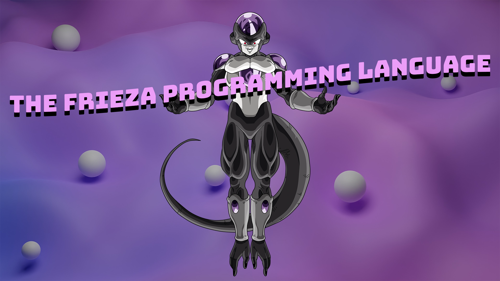

# frieza programming language - not for filthy saiyan monkeys



```
let j = "juice"
let wrld = "WRLD"

print j + " " + wrld // "juice WRLD"

fun add(x, y)
    return x + y
end

if add(2, 3) > 4
    print "nah"
else 
    print "yah"
end

let arr = ["free", "rondo", "numba", "9"] 

let free = ""
for a in arr
    free = free + a
end

print free

protocol Warrior
    fun fight()
end

enum Form
    base, superSaiyan
end

struct Saiyan: Warrior
    let name: string
    let powerLevel: int
    let currentForm: From
  
    fun fight()
        powerUp()
        transform(.superSaiyan)
        return powerLevel
    end

    fun powerUp()
        print "scream"
    end

    fun transform(form)
        currentForm = form
    end
  
    fun goSuperSaiyan
        if currentForm != .superSaiyan
            transform(.superSaiyan)
        end
    end
end
```